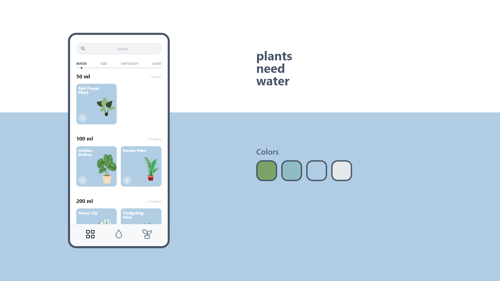
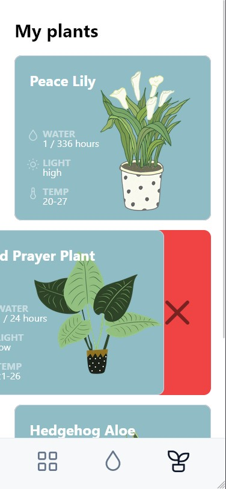
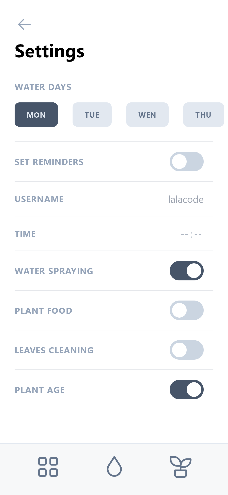

# [Plants need water](https://waterplant.vercel.app/)

### Desktop

### Mobile (portrait)

### Mobile (landscape)

## 1. Design by [Marina Seryogina](https://www.behance.net/Marina_Seryogina)

- Initial design concept on [behance](https://www.behance.net/gallery/81051045/Plants-Need-Water-Mobile-App-Concept):
  

## 2. Database via Supabase

- [API Documentation](https://supabase.com/docs/guides/database/api)

## 3. Libraries

- React.js / Next.js
- Tailwind.css
- Framer-motion
